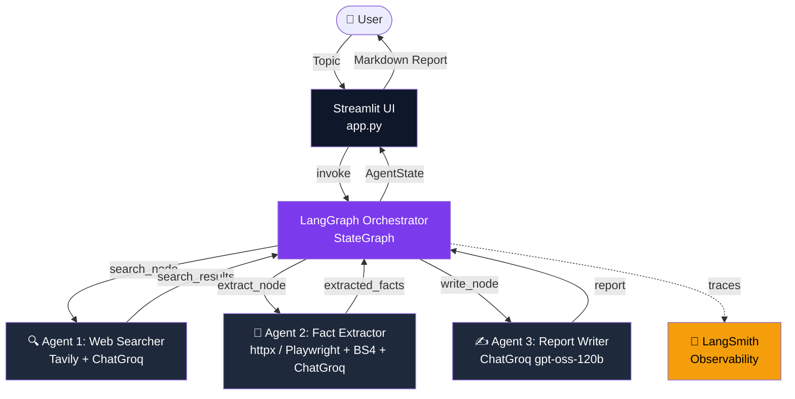
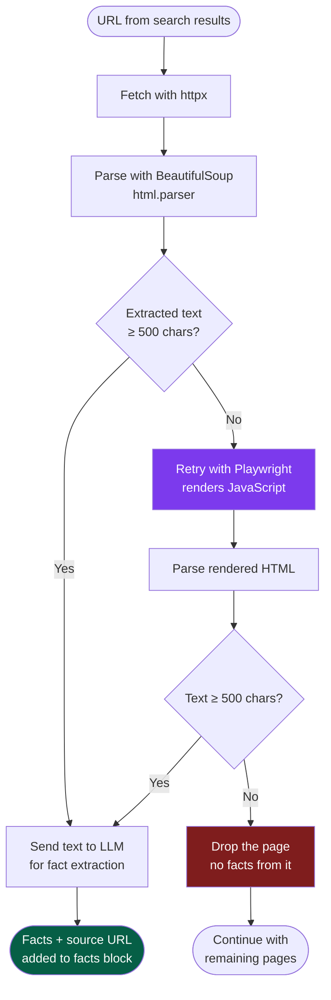
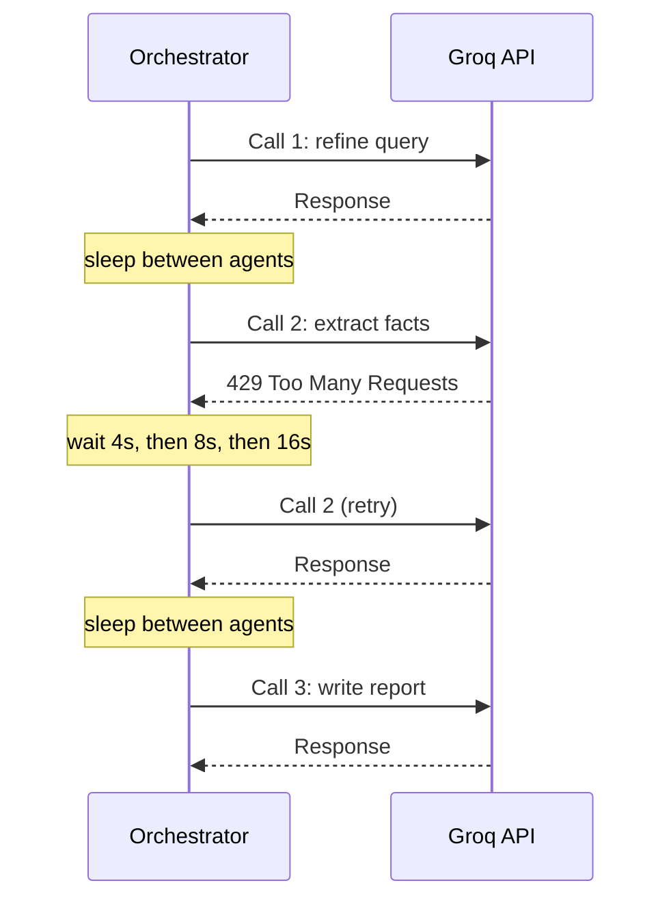

# 🔭 MARS: Multi-Agent Research System

**A three-agent pipeline that turns a topic into a report where every claim links to a page it actually fetched.**

[](https://python.org)
[](https://langchain-ai.github.io/langgraph/)
[](https://console.groq.com)
[](https://tavily.com)
[](https://streamlit.io)
[](https://smith.langchain.com)

*Enter a topic → three agents search the web, extract facts from the pages, and write a report that may only use those facts.*

**[🚀 Live Demo](https://ajitabh-12-7-mk-1-app.streamlit.app)** · **[📊 Architecture](#architecture)** · **[📈 Results](#results)** · **[⚠️ Limitations](#limitations)**

---

## What is MARS?

LLM summaries sound confident even when nothing backs them up. MARS tests whether a strict pipeline can fix that: the writer agent never browses and never answers from memory. It only sees facts that an earlier agent extracted from pages it really fetched, and each fact carries its source URL.

```
User Topic  →  [🔍 Searcher]  →  [📄 Extractor]  →  [✍️ Writer]  →  Cited Report
```

| Agent | Tools | Responsibility |
| --- | --- | --- |
| 🔍 **Web Searcher** | Tavily API + Groq LLM | Rewrites the query, searches the web, returns the top 10 sources |
| 📄 **Fact Extractor** | httpx + BeautifulSoup4 + Playwright + Groq LLM | Fetches pages, strips boilerplate, extracts key facts with their source URLs |
| ✍️ **Report Writer** | Groq LLM (`gpt-oss-120b`) | Writes a structured markdown report using only the extracted facts |

**What the pipeline guarantees, and what it doesn't.** It constrains the writer to fetched content and keeps every claim traceable to a URL. It does *not* verify that a source is correct, or that the model read a page correctly. See [Limitations](#limitations).

---

## Architecture



### How a page gets fetched

The extractor tries the cheap path first and only starts a headless browser when it has to.



### How rate limits are handled



**Key design decisions**

- **LangGraph over CrewAI/AutoGen.** A graph-based state model with explicit transitions. Every `search_results → extracted_facts → report` handoff is typed and inspectable in LangSmith.
- **Groq with an open-weight model.** Fast inference on a free tier, using OpenAI's open-weight `gpt-oss-120b`. Swapping models is a config change, not a pipeline change (see challenge 5 below).
- **Tavily over SerpAPI.** Built for LLM agents. It returns clean structured results rather than raw scraped HTML.
- **Streamlit for the UI.** The fastest path to a public live URL. React is planned for v2.

---

## Real Engineering Challenges I Solved

> *The problems that don't show up in tutorials.*

### 1. Groq rate limits on the free tier

Each run makes **three** LLM calls (query refinement, fact extraction, report writing), and the free tier caps requests per minute. Early runs crashed with `429 Too Many Requests` partway through the pipeline.

**Fix:** a short `time.sleep` between agent transitions in `orchestrator.py`, plus exponential backoff on 429 responses:

```python
for attempt in range(MAX_RETRIES):
    try:
        return llm.invoke(messages)
    except Exception as e:
        if "429" in str(e):
            wait = BACKOFF_BASE ** attempt
            time.sleep(wait)
        else:
            raise
```

### 2. httpx vs Playwright: when to use which

A plain `httpx.get()` fails silently on JavaScript-rendered pages (React SPAs, Next.js sites). In early testing, about **30% of URLs** returned empty text.

**Fix:** two-stage fetching. httpx first, Playwright only when the body is too short:

```python
text = await _fetch_httpx(url)
if len(text) < 500:
    text = await _fetch_playwright(url)
```

### 3. The writer adding facts from its own training data

Early writer prompts produced confident reports that included facts not present in the extracted data.

**Fix:** a grounding prompt with a hard constraint. The writer receives only the output of `_build_facts_block()`:

```
STRICT RULE: Only use facts from the FACTS BLOCK below.
Do NOT add anything from your training data.
If a fact is not in the block, do not write it.
```

A prompt rule reduces this problem but does not eliminate it, which is why [Limitations](#limitations) lists it.

### 4. BeautifulSoup parser compatibility

`lxml` needs Microsoft C++ Build Tools on Windows, a very large download to require from users.

**Fix:** Python's built-in `html.parser`. It is slower but has zero extra dependencies and works on every platform:

```python
soup = BeautifulSoup(html, "html.parser")  # no C++ Build Tools needed
```

### 5. The original model was discontinued

MARS first ran on `llama-3.3-70b-versatile`. When that model was discontinued on Groq, runs started failing.

**Fix:** migrated to OpenAI's open-weight `gpt-oss-120b`, served on Groq. Because the model ID is set in one place, the pipeline code did not need to change. After the swap, the grounding prompt and the extraction prompts were re-tested, since a new model can follow instructions differently.

---

## Results

> Replace the bracketed values with numbers from your own test runs. Run at least 10 diverse topics and count.

| Metric | Before fixes | After fixes |
| --- | --- | --- |
| Pages returning usable text | ~70% | [X]% |
| Runs finishing with no rate-limit failure | [X]% | [X]% |
| Claims supported by the page they cite (manual check of [N] reports) | n/a | [X]% |
| Median time per report | n/a | [X] s |

**Test set:** [N] topics, [describe: e.g. mix of tech, health, news].
**How "supported" was judged:** [e.g. I opened each cited URL and checked the claim against the page text].

---

## Limitations

- **Citations show provenance, not truth.** A claim linked to a fetched page tells you where it came from. If the page is wrong, or the model misread it, the report can still be wrong.
- **The grounding rule is a prompt, not a guarantee.** The writer can still paraphrase loosely or blend two facts. A post-check that matches each sentence back to a stored fact is on the roadmap.
- **Pages that block bots or need a login are dropped.** Coverage depends on what httpx and Playwright can reach.
- **Source quality is not ranked.** The top 10 Tavily results are treated equally.
- **Free-tier limits.** Throughput is bounded by the providers' free quotas, so this is a demo-scale system.

---

## Quickstart

### 1. Clone

```bash
git clone https://github.com/Ajitabh-12-7/MARS.git
cd MARS
```

### 2. Virtual environment

```bash
# Windows
python -m venv .venv
.venv\Scripts\Activate

# macOS / Linux
python -m venv .venv
source .venv/bin/activate
```

### 3. Install

```bash
pip install -r requirements.txt
python -m playwright install chromium   # needed for the JS-rendering fallback
```

### 4. Configure API keys

```bash
cp .env.example .env      # Windows: copy .env.example .env
# Edit .env and add GROQ_API_KEY, TAVILY_API_KEY, LANGCHAIN_API_KEY
```

### 5. Run

```bash
python -m streamlit run app.py
```

Open **http://localhost:8501**

---

## Free API Keys

| Key | Link | Notes |
| --- | --- | --- |
| `GROQ_API_KEY` | [console.groq.com](https://console.groq.com) | Free tier with per-minute and daily limits. Check the console for current values |
| `TAVILY_API_KEY` | [app.tavily.com](https://app.tavily.com) | Free monthly search allowance |
| `LANGCHAIN_API_KEY` | [smith.langchain.com](https://smith.langchain.com) | Free tracing tier |

---

## Tech Stack

| Layer | Technology |
| --- | --- |
| Agent framework | LangGraph 0.2.x |
| LLM | Groq + `openai/gpt-oss-120b` |
| Web search | Tavily Python SDK |
| Web scraping | httpx + BeautifulSoup4 + Playwright |
| UI | Streamlit 1.35+ |
| Observability | LangSmith |
| Hosting | Streamlit Community Cloud |

---

## Project Structure

```
MARS/
├── app.py               # Streamlit UI
├── orchestrator.py      # LangGraph StateGraph pipeline
├── config.py            # Env/key loading and model settings
├── requirements.txt
├── .env.example
├── .streamlit/
│   └── config.toml      # Dark theme config
├── agents/
│   ├── searcher.py      # Agent 1: Web Searcher
│   ├── extractor.py     # Agent 2: Fact Extractor
│   └── writer.py        # Agent 3: Report Writer
├── docs/
├── tests/
│   └── test_pipeline.py # Unit + integration tests
├── SETUP.md
└── TODO.md
```

---

## Roadmap

- [ ] Post-generation check that maps each report sentence to a stored fact
- [ ] Source quality ranking before extraction
- [ ] Evaluation script that produces the numbers in [Results](#results) automatically
- [ ] React front end

---

## Author

**Ajitabh Mishra**
LangGraph · Groq · Tavily · Streamlit · LangSmith
